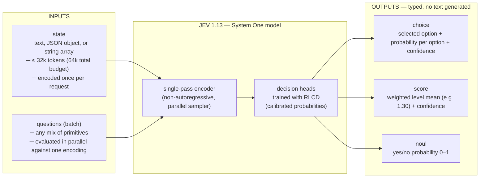

# jev-snake

A Nokia Snake II clone driven in real time by [Jev](https://docs.typesafe.ai) — TypeSafe's "System One" decision model (`jev-1.13`), served through [OpenCode Zen](https://opencode.ai/docs/zen). The snake plays itself: every route on the board is a single typed decision returned by the model. A human can take over with the keyboard and hand control back at any time.

No local fallback exists on purpose — if the model cannot answer, the snake waits for the model.

---

## Table of contents

- [What is Jev?](#what-is-jev)
- [Jev architecture](#jev-architecture)
- [Advantages over frontier LLMs](#advantages-over-frontier-llms)
- [Known limitations](#known-limitations)
- [Use cases](#use-cases)
- [This repo: how jev-snake works](#this-repo-how-jev-snake-works)
- [Getting started](#getting-started)
- [Sources](#sources)

---

## What is Jev?

Jev is the first of a class of models TypeSafe calls **System One** models — named after Kahneman's *Thinking, Fast and Slow*. An LLM is System 2: it generates text token by token, which makes it slow and expensive when used as a classifier, and its output must be parsed back into data. A System One model does the opposite: it **does not generate text at all**. You send it a `state` and a batch of typed questions; it returns structured answers with calibrated probabilities that your code branches on directly.

The API exposes three question primitives, all evaluated against the same state in one request:

| Primitive | Shape | Returns |
|-----------|-------|---------|
| `choice` | Categorical, up to 255 named options | Selected option + probability per option + confidence |
| `score`  | Ordered scale, 2–10 levels | Probability-weighted level mean (e.g. 70% L1 / 30% L2 → `1.30`) + confidence |
| `noul`   | Binary yes/no | Probability 0–1 (the number *is* the certainty measure) |



Example request and response (from the official API docs):

```json
// POST /v1/systemone
{
  "model": "jev-1.13.0",
  "state": "Customer emailed twice this week about a failed refund...",
  "questions": {
    "wants_refund": { "type": "noul", "instructions": "..." },
    "queue":        { "type": "choice", "criteria": { "billing": null, "technical": null, "sales": null } },
    "urgency":      { "type": "score", "criteria": ["Can wait a week", "...", "Needs a reply today"] }
  }
}
```

```json
{
  "model": "jev-1.13.0",
  "answers": {
    "wants_refund": { "type": "noul", "noul": 0.99 },
    "queue":        { "type": "choice", "choice": "billing", "confidence": 1,
                      "probabilities": { "sales": 0, "billing": 1, "technical": 0 } },
    "urgency":      { "type": "score", "score": 2, "confidence": 1 }
  },
  "usage": { "input_tokens": 451, "output_tokens": 72 }
}
```

Output tokens are not billed ("too cheap to meter"). Pricing is input-only: **$0.042 per Mtok** ($42 per Btok).

Served endpoints:

- TypeSafe direct: `POST https://api.typesafe.ai/v1/systemone`
- OpenCode Zen gateway (used by this repo): `POST https://opencode.ai/zen/v1/systemone`
- OpenRouter: `typesafe/jev-1.13`

Model IDs: `jev-1.13` (paid, requires `OPENCODE_API_KEY` on Zen) and `jev-1.13-free` (limited-time, anonymous requests accepted). Aliases `jev-latest` / `jev-preview` currently resolve to `1.13.0`.

## Jev architecture

TypeSafe has not published weights, a paper, or a parameter count. What is documented, plus what the CEO confirmed in the Hacker News launch thread:

- **Non-autoregressive, single-pass inference.** The launch post describes "a new model architecture, parallel sampler for maximum efficiency" that "generates all outputs in a single query rather than autoregressively." Jev ingests the `state` once and evaluates every question against that encoding in parallel — adding questions to a call adds little latency, consistent with questions being scored off one shared forward pass rather than a decode loop.
- **Encoder-with-heads shape.** The CEO confirmed the "zero-shot classifier" reading and an encoder-with-classification-heads design in the HN thread. Community reconstructions follow this shape (e.g. the open reproduction *Laya*: a ModernBERT-large 395M encoder, 28 layers, hidden 1024, 16 heads, plus a ~25.2M decision-head transformer). Some observers argue for a constrained/diffusion-like decoder instead; nothing is officially settled.
- **RLCD training — Reinforcement Learning for Calibrated Decisions.** Positioned against RLHF (rewards preferred text) and RLVR (rewards verifiable outputs), RLCD rewards *epistemically honest probabilities*. Calibration is defined group-wise: answers assigned probability 0.8 should occur about 80% of the time — a property of prediction groups, not a guarantee about any single answer. TechCrunch reported Jev is trained exclusively on synthetic data. Independent write-ups reconstruct the likely reward as strictly proper scoring rules (log/spherical score, RPS) with policy-gradient methods plus post-hoc temperature scaling; this is inference, not documentation.
- **No test-time compute.** With no decode loop, the model cannot "think longer" on hard cases. This is the architectural root of its documented weaknesses (counting, dates, multi-hop indirection — see [limitations](#known-limitations)).

Published specs for `jev-1.13`:

| Spec | Value |
|------|-------|
| Context | 64k tokens per request; 32k for `state` + longest question |
| Input | Text only (string, JSON object, or array of strings). No image/audio/video |
| Rate limits | 250,000 tokens/sec; 1,200 requests/min |
| Price | $42/Btok input; output free |
| Latency (vendor claim) | 70–500 ms end-to-end |
| Training data | Synthetic only (per TechCrunch, Sept 2026) |

## Advantages over frontier LLMs

Numbers below are vendor-reported (TypeSafe's own evaluation tables) unless marked independent; no large-scale independent reproduction of the headline figures has surfaced yet.

| Metric | Jev 1.13 | GPT-5.6 Terra | GPT-5.6 Sol | Claude Opus 5 | Claude Haiku 4.5 |
|--------|----------|---------------|-------------|---------------|------------------|
| Latency per decision | ~0.4 s | 10.1 s | 23.3 s | 37.8 s | – |
| Input price (per MTok) | $0.042 | $2.00 | $2.00 | $5.00 | $1.00 |
| Output price | free | $12.00 | $12.00 | $25.00 | $5.00 |
| Cost per classified case | ~$0.0004 | $0.0304 | $0.0836 | $0.1761 | – |
| Workflow agreement | 67.8% | 67.9% | 74.1% | 73.1% | – |
| Structured-output error rate | 0% (guaranteed by schema, not empirical) | 0.58% | – | 5.73% | 45.5% |

Headline vendor claims — up to **193× faster** and **444× cheaper** than frontier LLMs — are on the high end; independent evaluations (jev.novcog.us.com) found more realistic multipliers of ~5× faster / ~8.6× cheaper against cheap competitors, with Jev at 96% accuracy, 0.59 s average latency, and $0.043 per 1,000 decisions in one benchmark.

Mechanically, the advantages over using an autoregressive LLM as a classifier:

1. **Type safety by construction.** Output is constrained to `choice` / `score` / `noul` shapes — an invalid value or type error is *unrepresentable*, not merely unlikely. An LLM can only approximate this with grammar-constrained decoding and still requires parsing.
2. **Calibrated confidence.** RLCD training makes the probabilities usable for threshold-based routing ("auto-act above 0.9, confirm between, escalate below"). LLMs are notoriously overconfident and emit hallucinated probabilities even under constrained decoding.
3. **Parallel fan-out.** State is encoded once; many questions are answered in one call. Counting N objects is one Noul per item, summed in code.
4. **Zero-shot deployment.** Any bounded classification problem works from natural-language criteria in minutes, without fine-tuning a BERT-class model.
5. **Throughput.** 250k tok/s and 1,200 req/min serve high-frequency decision loops (the viral Jev-plays-Doom demo runs ~10 decisions/sec at ~$7/hour).

The trade-off, stated plainly: Jev trades roughly 5–6 points of task accuracy against GPT-5.6-class models (67.8% vs 74.1% on TypeSafe's 4-workflow eval) for 1–2 orders of magnitude in cost and latency, and it cannot produce rationales — there is no chain of thought to audit.

## Known limitations

TypeSafe documents these itself on the [Jev 1.13 jaggedness page](https://docs.typesafe.ai/model-jaggedness/jev-1.13):

1. **Literal reading** — answers the question you wrote, not the one you meant.
2. **Math and counting** — does not count reliably; error grows with the size of the thing counted.
3. **Dates** — reads dates as text, not as ordered quantities.
4. **Indirection** — double negatives and multi-hop reasoning degrade accuracy.
5. **Distractor state** — accuracy falls as the state grows with content unrelated to the decision.
6. **Adversarial content** — does not treat the state as hostile by default.
7. **No joint distribution** — a Noul and its equivalent Choice can disagree; P(A) + P(¬A) has been observed at 1.19.
8. **Generation is impossible** — the model refuses any open-ended task by design.
9. **English-primary** — other languages including CJK work but with lower accuracy; validate against your own data.

Also: text-only input, closed weights, no self-hosting. HN critics add that "type safety is not factual correctness" — Jev cannot emit an invalid type but can be confidently wrong with a valid one, and the launch benchmarks are vendor-run with reference answers produced by other LLMs.

## Use cases

A sample of documented community and official patterns:

| Use case | What Jev does | Link |
|----------|---------------|------|
| Intent routing / triage | Choice over request categories + Score for urgency; ~90% of simple requests bypass frontier models entirely | [docs.typesafe.ai](https://docs.typesafe.ai) |
| LLM tier routing | Per-turn Choice of model tier for coding agents (~$0.00003, ~0.6 s per routing decision, ~60% savings on a 237-turn replay) | [jev-agent.com](https://jev-agent.com/use-cases/llm-model-routing) |
| Command approvals | Six parallel questions (verdict, blast radius, reads-secrets…) replace an LLM reviewer in the Hermes agent | [hermes-jev-approvals](https://github.com/anpicasso/hermes-jev-approvals) |
| Context compaction | Two Noul questions per tool call decide what stale context a Claude Code session can drop (~1M tokens → ~86K in ~1 s) | [fast-jev-compaction](https://github.com/tamaratran/fast-jev-compaction) |
| Moderation / guardrails | Noul-based safety verdicts and prompt-injection detection; 98.9% on moderation in an independent bench vs 83.3% for a fine-tuned encoder | [sysone-bench](https://github.com/instax-dutta/sysone-bench) |
| Scoring & calibration tuning | Composite Scores (severity × sentiment × reproducibility) weighted in code; threshold-tuning CLI improved frustration accuracy 0.69 → 0.92 | [jev-calibrate](https://github.com/smkrv/jev-calibrate) |
| Real-time game/agent control | Jev playing Doom from entity state; browser games; a Franka Panda robot arm (43/50 trials) | [awesome-jev gallery](https://github.com/OmniJev/awesome-jev-gallery) |
| RAG relevance / search | Re-ranking retrieved candidates; picking sources and time ranges | [jev-search](https://github.com/superagents-lab/jev-search) |
| Browser automation | Every agent step is one Choice over an indexed element table (Google Flights search in 7.1 s) | [jev-ultrafast](https://github.com/browser-use/jev-ultrafast) |

This repo is in the last-but-one category: real-time game control, where decisions must arrive faster than the game loop.

---

## This repo: how jev-snake works

### Architecture

```
┌─────────────────────────── browser ───────────────────────────┐
│                                                               │
│  game.js ──► brain.js                                         │
│    │            │  1. snapshot board state                    │
│    │            │  2. build candidate routes (BFS-ish,        │
│    │            │     on the projected snake body)             │
│    │            │  3. one `choice` question: pick a route      │
│    │            │  4. play route step-by-step, prefetch at     │
│    │            │     FIRE_AT=6 steps remaining                │
│    ▼            ▼                                              │
│  LCD canvas   decision log / probability bars / stats          │
└───────────────┬───────────────────────────────────────────────┘
                │ POST /api/decide
┌───────────────▼───────────── Node proxy (server.js, :8787) ───┐
│  zero-dependency http server                                  │
│  • loads OPENCODE_API_KEY from .env                           │
│  • @typesafe-ai/sdk if installed, raw fetch fallback          │
│  • allow-list: jev-1.13 | jev-1.13-free                       │
└───────────────┬───────────────────────────────────────────────┘
                │ POST /v1/systemone
┌───────────────▼───────────────────────────────────────────────┐
│         OpenCode Zen  →  TypeSafe Jev (jev-1.13)              │
└───────────────────────────────────────────────────────────────┘
```

### The decision loop

The interesting design is in `public/brain.js` — how a 70–500 ms remote decision model drives a real-time game loop:

1. **Complete routes, not single moves.** Each call does not ask "which way now?" It offers a handful of *complete candidate routes* (comma-separated step tokens, `stay` = keep previous direction) computed on the projected snake body, and asks one `choice` question: *pick the best complete route.* The model reasons about survival over many steps, not one.
2. **Pipelining with prefetch.** The chosen route fills a step queue. When the queue drains to `FIRE_AT = 6` steps remaining, the next request fires in the background — so latency is hidden behind gameplay rather than added to it. A fresh route is requested the instant the apple is eaten.
3. **Staleness voiding.** Every request carries a board-state key. If the board changed while the call was in flight (human took over, bonus bug expired), the returned route is discarded as stale and re-asked — never played.
4. **Retry with backoff.** 429 responses honor `retry-after` (capped at 30 s); other failures back off 1.2 s × attempt (capped at 5 s); the request aborts at 20 s and retries.
5. **No local fallback.** If no legal route exists, the snake is trapped and dies. If the model can't answer, the snake waits. The point of the demo is that Jev is the brain, not an ornament.
6. **Visible calibration.** The HUD shows the probability bars for the last route choice and the returned `confidence`, so the model's calibrated outputs are observable in real time.

### Files

| File | Role |
|------|------|
| `server.js` | Zero-dependency Node server: static files + `POST /api/decide` proxy to Zen (`@typesafe-ai/sdk` with raw-fetch fallback) |
| `public/brain.js` | The decision engine: candidate routes, question building, plan queue, prefetch, staleness/retry logic |
| `public/game.js` | Snake II engine: board, wrap rules, bonus bug, levels, snapshotting, candidate-route generation, human takeover |
| `public/index.html` / `style.css` | Nokia-style LCD shell, HUD, decision log, probability bars |

### Controls

| Key | Action |
|-----|--------|
| Arrows / WASD | Take over from Jev |
| `J` | Return control to Jev |
| Space | Pause |
| Enter | Restart |

## Getting started

```bash
npm install

# .env
OPENCODE_API_KEY=your_opencode_zen_key

npm start
# → http://localhost:8787
```

- `jev-1.13` (default, paid) — requires the Zen key. Switch models by editing `MODEL` in `public/brain.js:3` (or the allow-list in `server.js`).
- `jev-1.13-free` — limited-time free tier; anonymous requests to Zen are accepted, so it runs even without a key in some setups.

Verified live session (2026-09-22): score 145+, level 3, zero deaths, with route-choice probability bars rendering in the HUD.

## Sources

- [Introducing System One Models and Jev](https://typesafe.ai/blog/introducing-system-one-models-and-jev) — TypeSafe launch post
- [System One concepts](https://docs.typesafe.ai/concepts/system-one) · [Models & pricing](https://docs.typesafe.ai/models) · [Jev 1.13 jaggedness](https://docs.typesafe.ai/model-jaggedness/jev-1.13) — official docs
- [Jev: TypeSafe's System One Model Explained](https://www.datacamp.com/blog/system-one-models-jev) — DataCamp analysis
- [Hacker News launch thread](https://news.ycombinator.com/item?id=49717558) — including CEO architecture confirmations
- [awesome-jev](https://github.com/OmniJev/awesome-jev) · [gallery](https://github.com/OmniJev/awesome-jev-gallery) — curated ecosystem
- [OpenCode Zen docs](https://opencode.ai/docs/zen) — gateway endpoint, free tier
- [openjev.top](https://openjev.top/en) · [jevai.org](https://www.jevai.org) · [systemonemodels.org](https://systemonemodels.org) — community hubs
